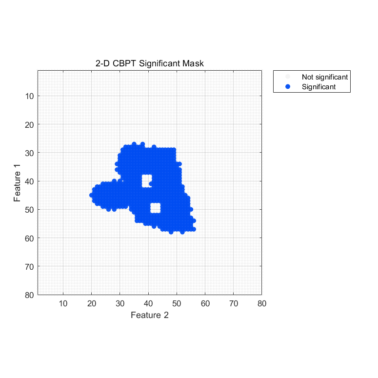
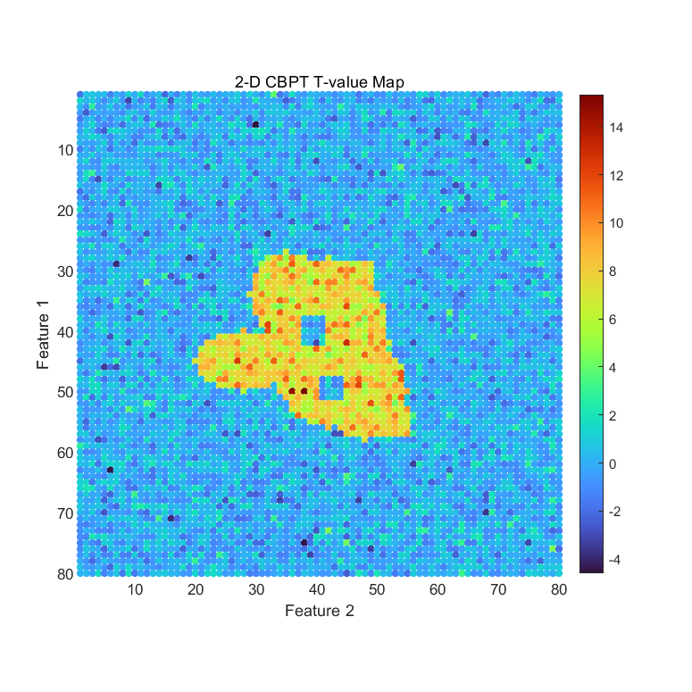

# swi_fast_cbpt

`swi_fast_cbpt` is a lightweight MATLAB implementation of matrix-based cluster permutation testing for arbitrary n-dimensional feature spaces.

It is designed for cases where the data can be represented as:

```text
sample x feature1 x feature2 x ... x featureN
```

The sample dimension can be trials, subjects, sessions, or any repeated observation unit. All remaining dimensions are treated as the feature space where clusters are formed.

## Features

- Works on generic numeric MATLAB arrays.
- Supports arbitrary n-dimensional feature spaces.
- Supports independent, paired, and one-sample/sign-flip designs.
- Supports grid-based adjacency or user-defined adjacency matrices / edge lists.
- Returns FieldTrip-like outputs including statistic maps, cluster labels, p-value maps, and significant masks.
- Includes synthetic 2-D and 3-D examples.

## Example Output

### Significant mask



### T-value map



## Requirements

This first version requires:

- MATLAB
- Statistics and Machine Learning Toolbox

No FieldTrip dependency is required.

## Quick Start

```matlab
addpath('path/to/swi_fast_cbpt');

cfg = [];
cfg.sampledim = 1;
cfg.design = 'paired';
cfg.numrandomization = 1000;
cfg.clusteralpha = 0.05;
cfg.alpha = 0.05;

stat = swi_fast_cbpt(cfg, X_condition_1, X_condition_2);
```

If the data are:

```text
subject x channel x frequency x time
```

then the output maps will be:

```text
channel x frequency x time
```

## Runnable Examples

```matlab
run('example_swi_fast_cbpt_2d.m')
run('example_swi_fast_cbpt_3d.m')
```

The examples create synthetic data, inject a known cluster-like effect, run CBPT, and plot:

- a significant mask
- a t-value map

## Important cfg Fields

```matlab
cfg.sampledim        = 1;              % sample dimension
cfg.design           = 'independent';  % 'independent', 'paired', or 'onesample'
cfg.tail             = 0;              % -1, 0, or 1
cfg.clusteralpha     = 0.05;           % point-level threshold
cfg.alpha            = 0.05;           % cluster-level threshold
cfg.clusterstatistic = 'maxsum';       % 'maxsum', 'maxsize', or 'maxabs'
cfg.numrandomization = 1000;           % number of permutations
cfg.adjacency        = [];             % optional adjacency matrix or edge list
cfg.connectivity     = 'axis';         % 'axis' or 'diagonal'
cfg.seed             = [];             % optional random seed
cfg.verbose          = true;
```

## Designs

### independent

Use this when samples in `X1` and `X2` are independent.

Examples:

```text
condition A trials vs condition B trials
group A subjects vs group B subjects
```

Permutation rule: shuffle condition labels across all samples.

### paired

Use this when each sample in `X1` has a matching sample in `X2`.

Examples:

```text
same subjects under two conditions
same trials under two measurements
```

Permutation rule: randomly swap condition labels within each pair.

### onesample

Use this when `X1` is already a difference array, or when `X1 - X2` should be tested against zero.

Permutation rule: random sign flipping.

## Adjacency

If `cfg.adjacency` is empty, the function builds a grid adjacency over the feature dimensions.

Default:

```matlab
cfg.connectivity = 'axis';
```

This means that two feature points are neighbors only when they differ by one step in one feature dimension and are identical in all other feature dimensions.

For a 1-D time vector:

```text
t(i) is connected to t(i-1) and t(i+1)
```

For a 2-D feature matrix:

```text
(i,j) is connected to (i-1,j), (i+1,j), (i,j-1), and (i,j+1)
```

For a 3-D feature matrix:

```text
6-connected neighborhood
```

You can also provide a custom sparse adjacency matrix:

```matlab
cfg.adjacency = sparse_adjacency_matrix;
```

or an edge list:

```matlab
cfg.adjacency = [
    1 2
    2 3
    5 9
];
```

Feature indices follow MATLAB column-major order after removing the sample dimension.

## Output

The output structure contains:

```matlab
stat.stat                    % observed t-statistic map
stat.prob                    % cluster-level p-value map
stat.mask                    % significant cluster mask
stat.posclusters             % positive cluster summaries
stat.negclusters             % negative cluster summaries
stat.posclusterslabelmat     % positive cluster labels
stat.negclusterslabelmat     % negative cluster labels
stat.posdistribution         % positive null distribution
stat.negdistribution         % negative null distribution
stat.cfg                     % final configuration
stat.feature_shape           % feature dimensions
```

## Interpretation

The significant mask marks features that belong to significant clusters. A significant cluster should be interpreted as significant as a whole. It should not be interpreted as proof that every individual feature inside the cluster is independently significant.

## Repository Description

Suggested GitHub description:

```text
Matrix-based cluster permutation test for arbitrary n-dimensional MATLAB data.
```

Suggested topics:

```text
matlab, statistics, permutation-test, cluster-permutation, cbpt, eeg, meg, neuroscience
```
